# May API and Communication Map

This page documents the current backend API surface, internal process flows, and outbound integrations for May.

It is organized around how data moves:

1. External clients call May APIs.
2. May routes validate auth and input.
3. Route handlers read/write SQLAlchemy models.
4. Internal services process reminders, calendar alarms, imports, exports, and integrations.
5. Some services communicate with external APIs such as SMTP, CalDAV, DVLA, Tessie, GitHub, ntfy, Pushover, and webhooks.

## High-level architecture

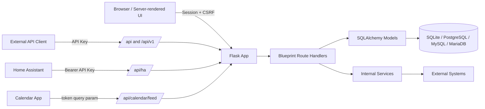

## Authentication models

May uses different authentication mechanisms depending on the route family.

| Route family | Auth style | Intended caller |
| --- | --- | --- |
| Web UI routes, for example `/vehicles`, `/auth/settings` | Flask session cookie + CSRF for forms | Browser users |
| `/api/v1/...` | API key via `Authorization: Bearer <api_key>` or `X-API-Key` | External apps/scripts |
| `/api/ha/...` | `Authorization: Bearer <api_key>` | Home Assistant |
| `/api/calendar/feed` and `/api/calendar/feed.ics` | `?token=<api_key>` query parameter | Calendar subscription apps |
| `/api/reminders/process` | Admin session, API key, or `X-Internal-Token` | Admin UI, cron, internal scheduler |
| `/api/dvla/*`, `/api/tessie/*`, `/api/smtp/test` | Session login, some admin-only | Browser/admin tools |

## API request flow

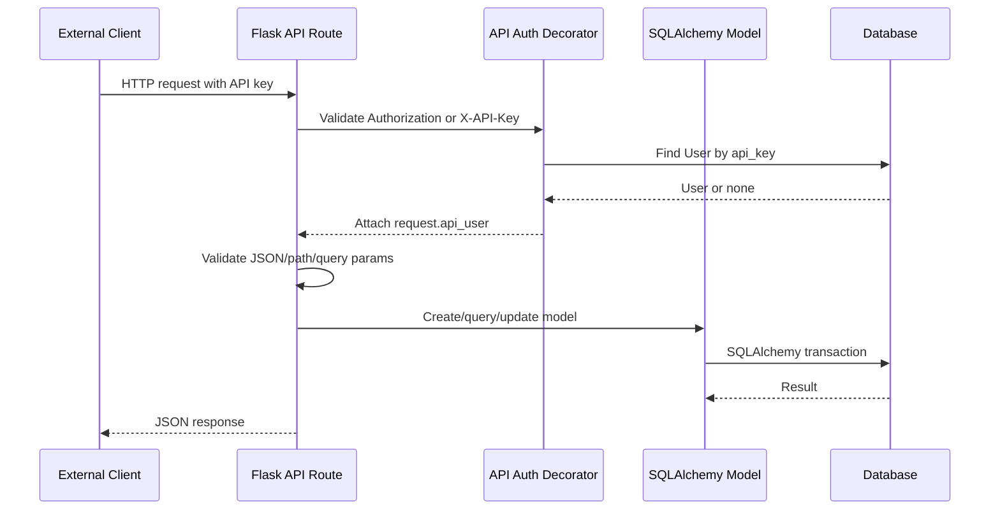

## Core public API: `/api/v1`

These endpoints are intended for external automation and integrations.

All require an API key:

```http
Authorization: Bearer <api_key>
```

or:

```http
X-API-Key: <api_key>
```

### Vehicles

| Method | Path | Purpose |
| --- | --- | --- |
| `GET` | `/api/v1/vehicles` | List vehicles visible to the API user |
| `POST` | `/api/v1/vehicles` | Create a vehicle |
| `GET` | `/api/v1/vehicles/{vehicle_id}` | Get one vehicle |
| `PUT/PATCH` | `/api/v1/vehicles/{vehicle_id}` | Update a vehicle |
| `DELETE` | `/api/v1/vehicles/{vehicle_id}` | Delete a vehicle |

Flow:

```mermaid
flowchart TD
    A[API client] --> B[/api/v1/vehicles]
    B --> C[api_auth_required]
    C --> D[User.get_all_vehicles]
    D --> E[Vehicle.to_dict]
    E --> F[JSON response]
```

### Fuel logs

| Method | Path | Purpose |
| --- | --- | --- |
| `GET` | `/api/v1/vehicles/{vehicle_id}/fuel` | List fuel logs for a vehicle |
| `POST` | `/api/v1/vehicles/{vehicle_id}/fuel` | Create a fuel log |
| `GET` | `/api/v1/fuel/{log_id}` | Get one fuel log |
| `PUT/PATCH` | `/api/v1/fuel/{log_id}` | Update one fuel log |
| `DELETE` | `/api/v1/fuel/{log_id}` | Delete one fuel log |

Important model interactions:

- `FuelLog`
- `Vehicle`
- `User`

The route checks that the fuel log's vehicle is accessible to the API user.

### Expenses

| Method | Path | Purpose |
| --- | --- | --- |
| `GET` | `/api/v1/vehicles/{vehicle_id}/expenses` | List expenses for a vehicle |
| `POST` | `/api/v1/vehicles/{vehicle_id}/expenses` | Create an expense |
| `GET` | `/api/v1/expenses/{expense_id}` | Get one expense |
| `PUT/PATCH` | `/api/v1/expenses/{expense_id}` | Update one expense |
| `DELETE` | `/api/v1/expenses/{expense_id}` | Delete one expense |

Important model interactions:

- `Expense`
- `Vehicle`
- `EXPENSE_CATEGORIES`

### Reminders

| Method | Path | Purpose |
| --- | --- | --- |
| `GET` | `/api/v1/reminders` | List reminders for all accessible vehicles |
| `POST` | `/api/v1/reminders` | Create a vehicle reminder |
| `GET` | `/api/v1/reminders/{reminder_id}` | Get one reminder |
| `PUT/PATCH` | `/api/v1/reminders/{reminder_id}` | Update one reminder |
| `DELETE` | `/api/v1/reminders/{reminder_id}` | Delete one reminder |

Important model interactions:

- `Reminder`
- `Vehicle`
- `REMINDER_TYPES`
- `RECURRENCE_OPTIONS`

Reminder lifecycle:

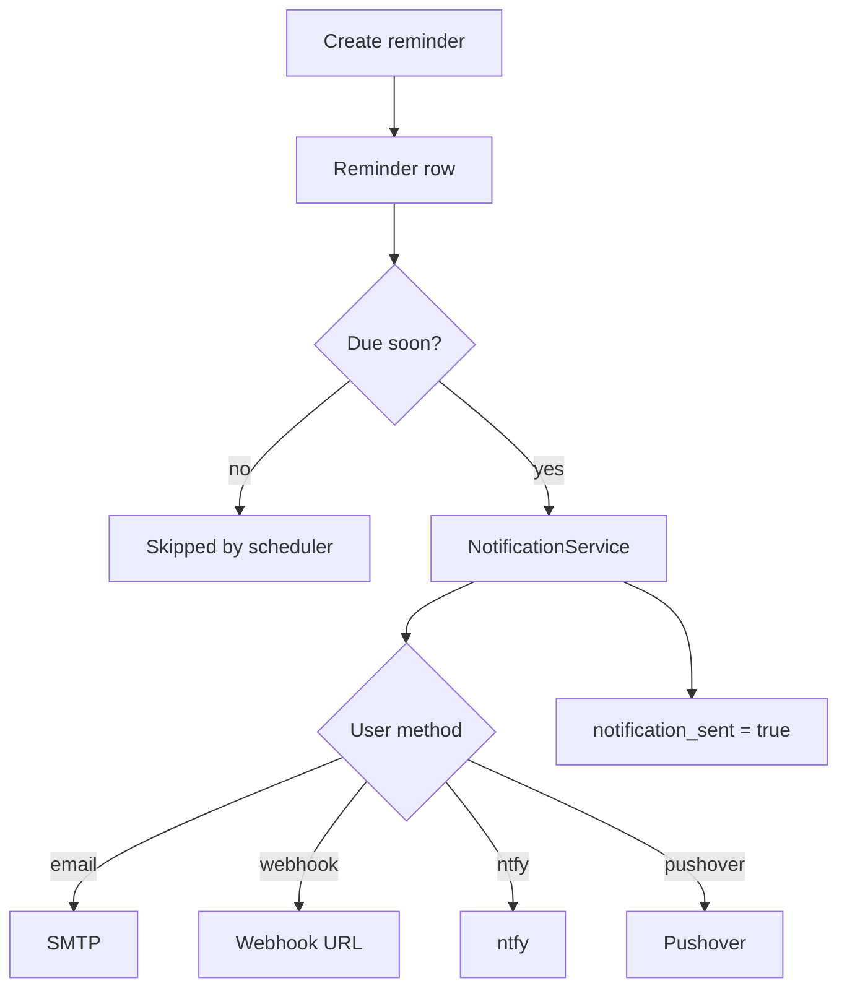

### Calendar events

| Method | Path | Purpose |
| --- | --- | --- |
| `GET` | `/api/v1/calendar/events` | List portable calendar events |
| `POST` | `/api/v1/calendar/events` | Create a portable calendar event |
| `GET` | `/api/v1/calendar/events/{event_id}` | Get one calendar event |
| `PUT/PATCH` | `/api/v1/calendar/events/{event_id}` | Update one calendar event |
| `DELETE` | `/api/v1/calendar/events/{event_id}` | Delete one calendar event |
| `POST` | `/api/v1/calendar/events/{event_id}/sync/caldav` | Publish one event to a CalDAV collection |

Important model interactions:

- `CalendarEvent`
- `CalendarAlarm`
- `Vehicle`

Calendar event fields include:

- `title`
- `description`
- `vehicle_id`
- `event_type`
- `status`
- `start_at`
- `end_at`
- `all_day`
- `timezone`
- `location`
- `url`
- `recurrence_rule`
- `alarms`
- `external_uid`
- `external_calendar_url`
- `external_etag`

CalDAV publish flow:

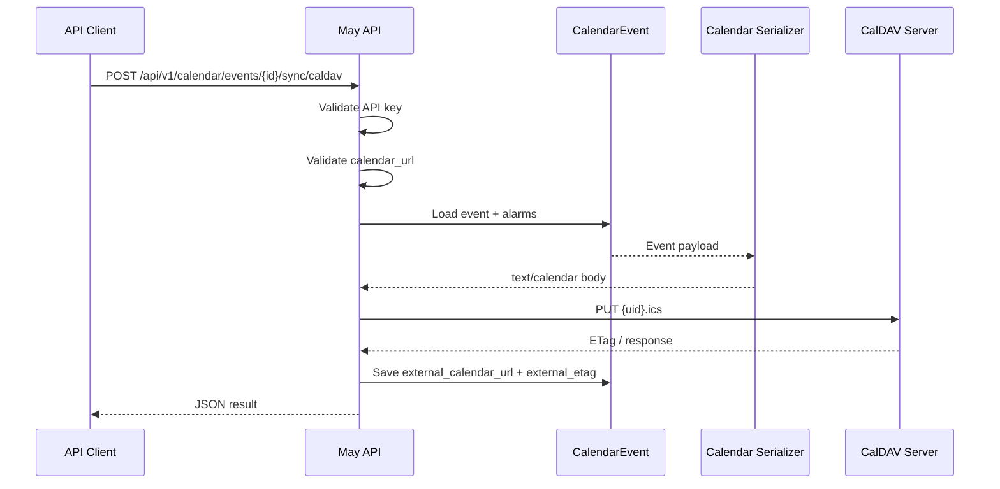

### Metadata

| Method | Path | Purpose |
| --- | --- | --- |
| `GET` | `/api/v1/categories` | List expense categories |
| `GET` | `/api/v1/reminder-types` | List reminder types and recurrence options |
| `GET` | `/api/v1/calendar/metadata` | List calendar event types, statuses, and alarm actions |

## Internal/session API: `/api`

These routes are mostly used by the web UI or admin tools.

| Method | Path | Auth | Purpose |
| --- | --- | --- | --- |
| `GET` | `/api/docs` | login | Render in-app API docs |
| `POST` | `/api/toggle-dark-mode` | login | Toggle user dark-mode setting |
| `POST` | `/api/key/generate` | login | Generate API key for current user |
| `POST` | `/api/key/revoke` | login | Revoke current API key |
| `POST` | `/api/notifications/test` | login | Send test notification using form values |
| `POST` | `/api/smtp/test` | admin | Test SMTP settings |
| `POST` | `/api/reminders/process` | admin/API/internal token | Process due reminders and calendar alarms |
| `GET` | `/api/uploads/{filename}` | public-ish | Serve uploaded files, including branding assets |
| `GET` | `/api/vehicles/{vehicle_id}/stats` | login | Internal chart/stat data |
| `GET` | `/api/vehicles/{vehicle_id}/last-odometer` | login | Last odometer for UI forms |

Reminder processing endpoint flow:

```mermaid
flowchart TD
    A[/api/reminders/process] --> B{Authorized?}
    B -->|No| C[401]
    B -->|Yes| D[process_due_reminders]
    D --> E[NotificationService]
    B -->|Yes| F[process_due_calendar_alarms]
    F --> E
    E --> G[SMTP / webhook / ntfy / Pushover]
    D --> H[Stats JSON]
    F --> H
```

## Calendar subscription API: `/api/calendar`

These endpoints are consumed by calendar applications.

| Method | Path | Auth | Purpose |
| --- | --- | --- | --- |
| `GET` | `/api/calendar/feed?token={api_key}` | query token | iCalendar feed |
| `GET` | `/api/calendar/feed.ics?token={api_key}` | query token | Same feed with `.ics` style URL |

The feed includes:

- maintenance schedules
- recurring expense due dates
- document expiry dates
- custom reminders
- generic `CalendarEvent` records

Calendar feed flow:

```mermaid
flowchart TD
    CalendarApp[Calendar app] --> Feed[/api/calendar/feed?token=...]
    Feed --> Auth[Find User by api_key]
    Auth --> Vehicles[User vehicles]
    Vehicles --> Maint[Maintenance schedules]
    Vehicles --> Recur[Recurring expenses]
    Vehicles --> Docs[Documents]
    Vehicles --> Reminders[Reminders]
    Auth --> Events[CalendarEvent records]
    Maint --> Serializer[iCalendar serializer]
    Recur --> Serializer
    Docs --> Serializer
    Reminders --> Serializer
    Events --> Serializer
    Serializer --> ICS[text/calendar response]
```

## Home Assistant API: `/api/ha`

These endpoints use `Authorization: Bearer <api_key>`.

| Method | Path | Purpose |
| --- | --- | --- |
| `GET` | `/api/ha/status` | Availability/status sensor |
| `GET` | `/api/ha/vehicles` | Vehicle list with basic stats |
| `GET` | `/api/ha/vehicles/{vehicle_id}` | One vehicle detail |
| `GET` | `/api/ha/vehicles/{vehicle_id}/stats` | Vehicle stats sensor data |
| `GET` | `/api/ha/alerts` | Active alerts |
| `GET` | `/api/ha/summary` | Fleet summary |
| `POST` | `/api/ha/fuel/add` | Add fuel log from automation |

Home Assistant flow:

```mermaid
flowchart LR
    HA[Home Assistant REST Sensor] -->|Bearer API key| MayHA[/api/ha/...]
    MayHA --> User[User by api_key]
    User --> Models[Vehicle/FuelLog/Expense/Reminder/etc.]
    Models --> JSON[Sensor JSON]
    JSON --> HA
```

## Integration/admin APIs

### DVLA

Routes:

| Method | Path | Auth | Purpose |
| --- | --- | --- | --- |
| `POST` | `/api/dvla/lookup` | login | Look up a UK vehicle registration |
| `POST` | `/api/dvla/test` | admin | Test DVLA API key |
| `GET` | `/api/dvla/status` | login | Check if DVLA is configured |
| `POST` | `/api/vehicles/{vehicle_id}/dvla-refresh` | login | Refresh saved vehicle DVLA fields |

External call:

```text
POST https://driver-vehicle-licensing.api.gov.uk/vehicle-enquiry/v1/vehicles
Header: x-api-key: <configured key>
```

DVLA flow:

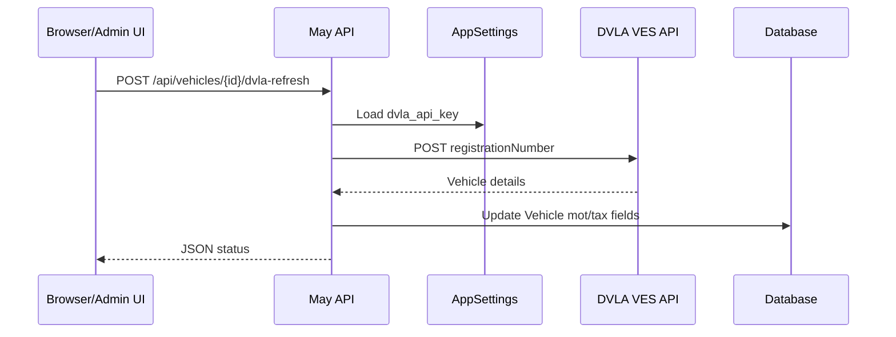

### Tessie

Routes:

| Method | Path | Auth | Purpose |
| --- | --- | --- | --- |
| `POST` | `/api/tessie/test` | admin | Test Tessie API token |
| `GET` | `/api/tessie/status` | login | Check if Tessie is configured |
| `GET` | `/api/tessie/vehicles` | login | List Tessie vehicles for linking |
| `POST` | `/api/vehicles/{vehicle_id}/tessie-refresh` | login | Refresh odometer/battery/range |
| `POST` | `/api/vehicles/{vehicle_id}/tessie-import-charges` | login | Import charge history |

External calls:

```text
GET https://api.tessie.com/vehicles
GET https://api.tessie.com/{vin}/state
GET https://api.tessie.com/{vin}/charges
Header: Authorization: Bearer <configured Tessie token>
```

Tessie import flow:

```mermaid
flowchart TD
    A[User clicks import Tessie charges] --> B[/api/vehicles/{id}/tessie-import-charges]
    B --> C[Load Vehicle tessie_vin]
    C --> D[TessieService.get_charges]
    D --> E[Tessie API]
    E --> F[Charge result list]
    F --> G{Already imported?}
    G -->|No| H[Create ChargingSession]
    G -->|Yes| I[Skip duplicate]
    H --> J[Commit DB]
    I --> J
    J --> K[JSON import stats]
```

### GitHub release check

Route:

| Method | Path | Auth | Purpose |
| --- | --- | --- | --- |
| `GET` | `/auth/check-updates` | login | Check latest GitHub release |

External call:

```text
GET https://api.github.com/repos/{GITHUB_REPO}/releases/latest
```

This returns:

- `latest_version`
- `current_version`
- `update_available`
- `release_url`
- `release_notes`
- `published_at`

## Notification and outbound communication services

### NotificationService

Used by:

- `/api/notifications/test`
- `/api/smtp/test`
- `process_due_reminders`
- `process_due_calendar_alarms`
- password reset email

Supported outbound channels:

| Channel | Transport | Config source |
| --- | --- | --- |
| Email/SMTP | `smtplib.SMTP` or `SMTP_SSL` | `AppSettings` SMTP values |
| Webhook | HTTP POST JSON | user `webhook_url` |
| ntfy | HTTP POST | user `ntfy_topic` |
| Pushover | HTTP POST JSON | app token + user key |

Notification flow:

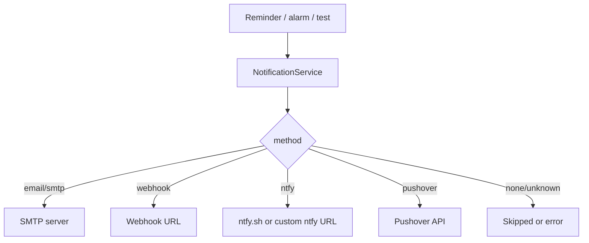

### CalDAVService

Used by:

```text
POST /api/v1/calendar/events/{event_id}/sync/caldav
```

External call:

```text
PUT {calendar_url}/{event_uid}.ics
Content-Type: text/calendar
Optional Authorization: Basic <username:password>
Optional If-Match: <external_etag>
```

The CalDAV endpoint validates the target URL using the same outbound URL-safety style used for webhooks before publishing.

## Import/export APIs

These are session-authenticated routes in `app/routes/api.py`.

| Method | Path | Purpose |
| --- | --- | --- |
| `GET` | `/api/export/csv` | Export app data as CSV |
| `GET` | `/api/export/json` | Export app data as JSON |
| `GET` | `/api/export/backup` | Export backup archive |
| `POST` | `/api/import/hammond` | Import Hammond data |
| `POST` | `/api/import/clarkson` | Import Clarkson data |
| `POST` | `/api/import/fuelly` | Import Fuelly CSV |
| `GET` | `/api/import/csv` | CSV import page |
| `POST` | `/api/import/csv/preview` | Preview CSV import |
| `POST` | `/api/import/csv/execute` | Execute CSV import |

Import flow:

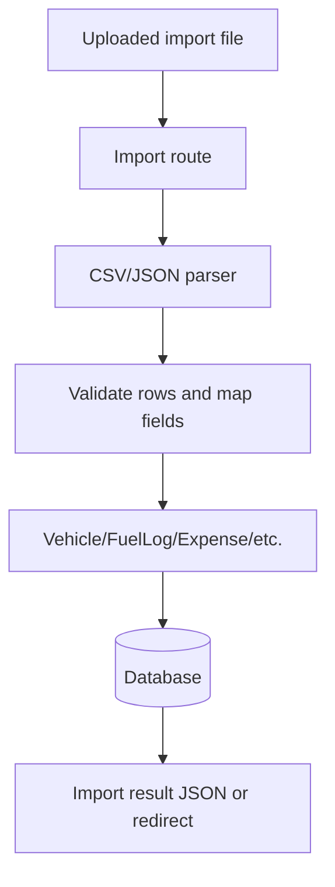

## Web UI route families

These are not public JSON APIs, but they call the same backend models/services and matter for end-to-end behavior.

| Route prefix | Purpose |
| --- | --- |
| `/auth` | Login, registration, settings, admin users, integration settings |
| `/vehicles` | Vehicle CRUD, sharing, reports, parts |
| `/fuel` | Fuel log CRUD and quick entry |
| `/expenses` | Expense CRUD and attachments |
| `/reminders` | Reminder CRUD and completion |
| `/maintenance` | Maintenance schedules |
| `/recurring` | Recurring expenses |
| `/documents` | Document upload/download/expiry |
| `/stations` | Fuel stations and price history |
| `/trips` | Trip logs and trip templates |
| `/charging` | EV charging sessions |
| `/notes` | Vehicle notes |
| `/allowance` | Mileage allowance |

Typical web form flow:

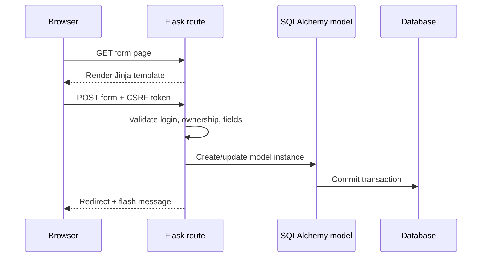

## Internal background processes

### Reminder scheduler

Started in `app/__init__.py` by `_start_reminder_scheduler(app)`.

Runs hourly after startup delay.

Calls:

```python
process_due_reminders()
process_due_calendar_alarms()
```

Scheduler flow:

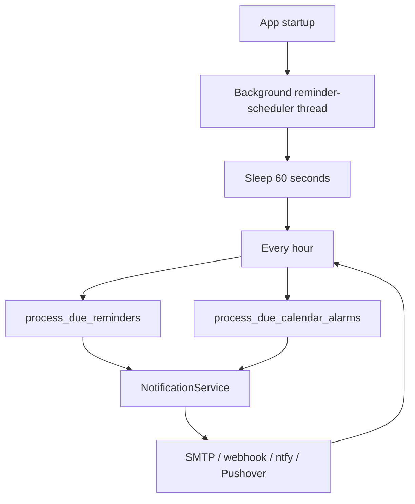

## Database communication

The app communicates with the database through SQLAlchemy.

Supported deployment targets:

- SQLite
- PostgreSQL
- MySQL
- MariaDB

Database URL is configured through:

```text
DATABASE_URL
```

or built from:

```text
DB_ENGINE
DB_HOST
DB_PORT
DB_NAME
DB_USER
DB_PASSWORD
SQLITE_PATH
```

Migration flow:

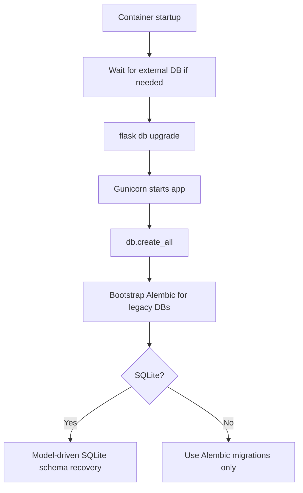

## Security boundaries

Important boundaries:

- Browser form routes require login and CSRF.
- Public API v1 routes require an API key.
- Home Assistant routes require Bearer API key.
- Calendar feed uses token query param because many calendar clients cannot set custom headers.
- Admin-only routes check `current_user.is_admin`.
- Outbound webhook/CalDAV URLs are validated to reduce SSRF risk.
- API endpoints are CSRF-exempt because they use API-key auth.

## External communication inventory

| External system | Direction | Trigger | Code area |
| --- | --- | --- | --- |
| SMTP server | Outbound | password reset, test notification, reminders, calendar alarms | `app/services/notifications.py` |
| Webhook URL | Outbound | user notification method or calendar alarm | `app/services/notifications.py` |
| ntfy | Outbound | user notification method | `app/services/notifications.py` |
| Pushover | Outbound | user notification method | `app/services/notifications.py` |
| CalDAV server | Outbound | `/api/v1/calendar/events/{id}/sync/caldav` | `app/services/caldav.py` |
| DVLA VES API | Outbound | DVLA lookup/refresh/test | `app/services/dvla.py` |
| Tessie API | Outbound | Tesla vehicle refresh/import/test | `app/services/tessie.py` |
| GitHub releases API | Outbound | `/auth/check-updates` | `app/routes/auth.py` |
| Calendar app | Inbound pull | subscribes to iCalendar feed | `app/routes/calendar.py` |
| Home Assistant | Inbound pull/push | REST sensors/automation | `app/routes/homeassistant.py` |

## End-to-end examples

### Example: external script creates a reminder

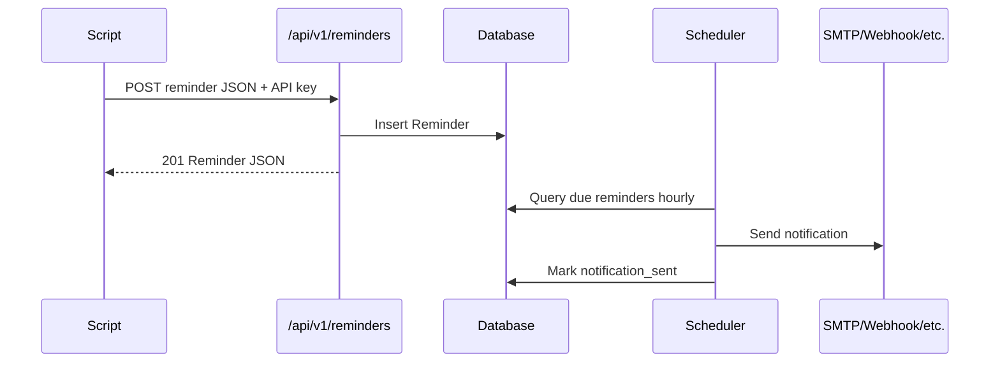

### Example: calendar client subscribes to May

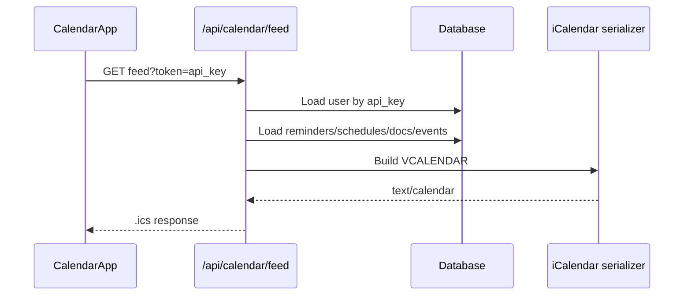

### Example: May publishes one event to CalDAV

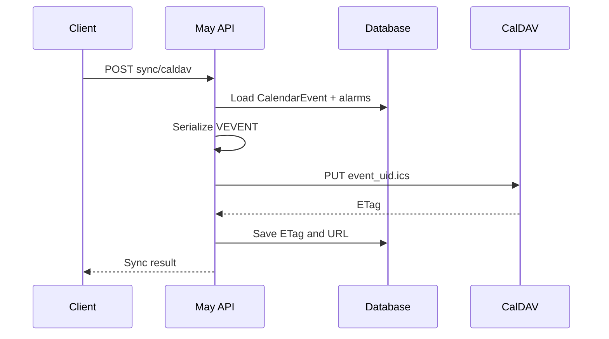

## Quick route index

Primary machine-facing route groups:

```text
/api/v1/vehicles
/api/v1/vehicles/{id}
/api/v1/vehicles/{id}/fuel
/api/v1/fuel/{id}
/api/v1/vehicles/{id}/expenses
/api/v1/expenses/{id}
/api/v1/reminders
/api/v1/reminders/{id}
/api/v1/calendar/events
/api/v1/calendar/events/{id}
/api/v1/calendar/events/{id}/sync/caldav
/api/v1/categories
/api/v1/reminder-types
/api/v1/calendar/metadata
/api/calendar/feed
/api/calendar/feed.ics
/api/ha/status
/api/ha/vehicles
/api/ha/vehicles/{id}
/api/ha/vehicles/{id}/stats
/api/ha/alerts
/api/ha/summary
/api/ha/fuel/add
/api/dvla/lookup
/api/dvla/test
/api/dvla/status
/api/tessie/test
/api/tessie/status
/api/tessie/vehicles
```

